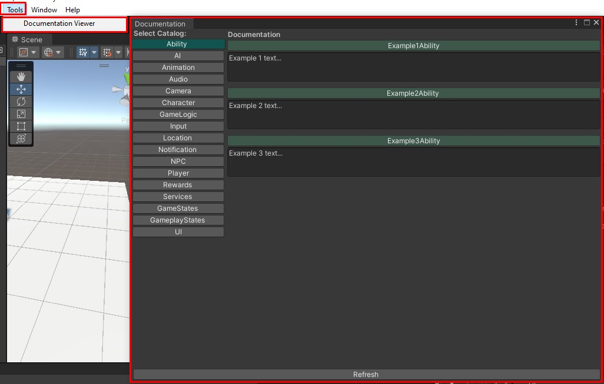

# Documentation Viewer - Удобная утилита для работы с документацией внутри игры!
Данный фреймворк был разработан в рамках работы в университете над архитектурой проекта, ECS как показывает практика изучается
не так быстро как хотелось бы, этот фреймворк создан для того, чтобы значительно ускорить процесс обучения команды, а также 
сделать код более гибким и читаемым!

# Лицензия
Выпускается под лицензией MIT, [подробности тут](./LICENSE).

# Интеграция с движками

## Unity
> Проверено на Unity 2020.3 (не зависит от нее) и содержит asmdef-описания для компиляции в виде отдельных сборок и уменьшения времени рекомпиляции основного проекта.

# Установка

## В виде unity модуля
Поддерживается установка в виде unity-модуля через git-ссылку в PackageManager:
```
"com.abc.unity": "https://github.com/datuloar/documentation.viewer.git",
```
По умолчанию используется последняя релизная версия. Если требуется версия "в разработке" с актуальными изменениями - следует переключиться на ветку `develop`:
```
"com.abc.unity": "https://github.com/datuloar/Documentation.viewer.git#develop",
```

## Пример использования аттрибута
Первым параметром идет DocumentationCatalogType - это каталог в который будет помещена документация.
Второй параметр это текст документации.

```c#
[Documentation(DocumentationCatalogType.Ability, "Text documentation")]
class ExampleAbility {
    // some logic
}
```
## Окно с документацией
<p align="center">
    
</p>

# TODO:
* Кеширование в json
* Экспорт документации в doc